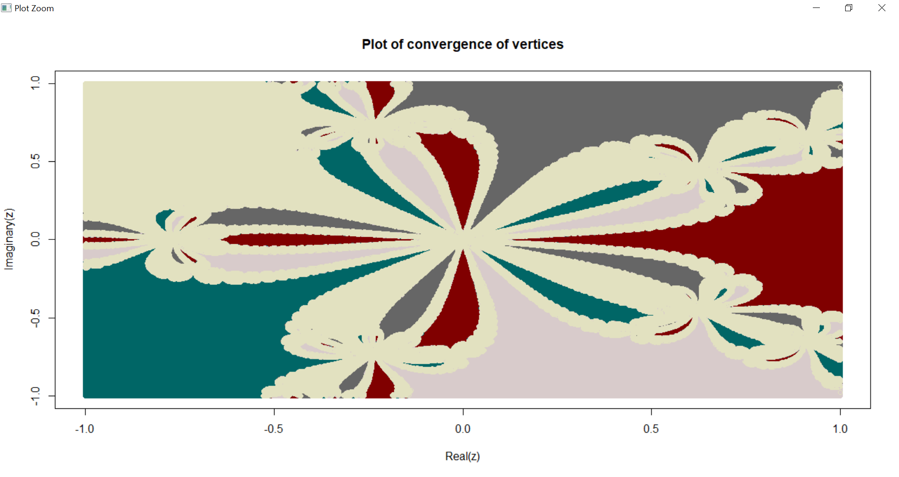

# R-newton-raphson-fractal-nth-root-from-scratch
The repository contains the code of Newton Raphson written in R language from scratch using mathematical equations without using any library. The R script for Newton Raphson is a well commented document to help understand  every step with proper explanation.

The best part of the code is that it is written from scratch without using any preexisting library to implement newton raphson.

The code not only implements newton raphson method to find nth root but also plots the convergence of the roots of the equation which results into a Fractal as shown in the image also.

The written code can help find nth root for any equation and is not limited in implementation. 

If you want to learn more about 
Newton Raphson https://en.wikipedia.org/wiki/Newton%27s_method
or 
Fractals https://en.wikipedia.org/wiki/Fractal

